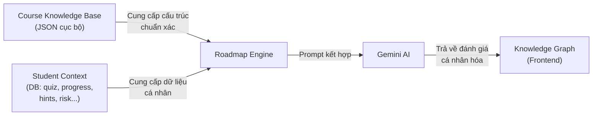

# Nâng cấp Dynamic Knowledge Graph — AI-Driven Learning Roadmap (v2)

## Mục tiêu
Biến trang Knowledge Graph từ mock data tĩnh thành hệ thống lộ trình học tập thông minh. AI phân tích dữ liệu cá nhân học sinh và đánh giá năng lực trên **cây kiến thức chính xác của từng môn** (Course Knowledge Base) để cá nhân hóa trạng thái và đề xuất lộ trình.

## Kiến trúc 2 tầng



### Tầng 1 — Course Knowledge Base (RAG-lite)
Mỗi môn học (DSA, LTNC, HĐH) sẽ có 1 file JSON chuẩn bị sẵn, chứa:
- Danh sách tất cả concept/skill nodes (tên, mô tả, vị trí trên graph).
- Quan hệ tiên quyết (edges: A phải học trước B).
- Metadata sư phạm (mức độ khó mặc định, thời gian ước lượng).

> **Tại sao?** AI không cần "bịa" ra cấu trúc môn học. Cây kiến thức được giáo viên/chuyên gia thiết kế sẵn và đảm bảo chính xác 100% về mặt academic. AI chỉ cần **đánh giá và map trạng thái** của học sinh lên cây này.

### Tầng 2 — Gemini AI Cá nhân hóa
AI nhận 2 inputs:
1. Knowledge Base của môn → biết cấu trúc chuẩn.
2. Student Context từ DB → biết năng lực thực tế.

AI trả về:
- Trạng thái mỗi node (`mastered` / `in-progress` / `locked`) + `mastery_pct`.
- `ai_insight`: Nhận xét tổng quan năng lực và xu hướng.
- `recommended_next`: Node tiếp theo nên tập trung.
- `weakness_areas`: Những concept yếu cần ôn lại.

---

## User Review Required

> [!IMPORTANT]
> **Cấu trúc cây kiến thức nằm trong file JSON cục bộ**, không phải do AI tự sinh. AI chỉ "tô màu" lên cây có sẵn (đánh trạng thái, gợi ý). Điều này đảm bảo cây luôn đúng về mặt sư phạm.

> [!WARNING]
> Tôi sẽ tạo knowledge base cho 3 môn: DSA, LTNC (C++), HĐH. Mỗi môn ~8-12 nodes. Nếu bạn muốn thêm/sửa nội dung cây, có thể chỉnh trực tiếp file JSON sau.

---

## Proposed Changes

---

### Backend — Course Knowledge Base

#### [NEW] `backend/knowledge_base/dsa.json`
Cây kỹ năng cho môn Data Structures & Algorithms (~10 nodes):
```
Big-O Notation → Arrays & Strings → Linked Lists → Hash Tables
                                   → Stacks & Queues → Trees & Graphs → Dynamic Programming
                                                                       → Shortest Path (Dijkstra/Floyd)
                → Sorting Algorithms → Binary Search
```

#### [NEW] `backend/knowledge_base/ltnc.json`
Cây kỹ năng cho môn Lập Trình Nâng Cao C++ (~10 nodes):
```
Variables & Data Types → Pointers & References → Memory Allocation (new/delete)
                       → OOP Basics (Class/Struct) → Inheritance & Polymorphism → Virtual Functions & vTable
                                                   → Operator Overloading
                       → Templates → STL Containers → Smart Pointers (unique/shared/weak)
```

#### [NEW] `backend/knowledge_base/hdh.json`
Cây kỹ năng cho môn Hệ Điều Hành (~10 nodes):
```
OS Concepts → Process & Thread → CPU Scheduling (FCFS/RR/SJF)
                               → Synchronization (Mutex/Semaphore) → Deadlock
            → Memory Management → Paging & Segmentation → Virtual Memory & TLB
            → File Systems → I/O Systems
```

#### [NEW] `backend/knowledge_base/loader.py`
Utility function `load_course_kb(course_module_name)`:
- Parse tên môn từ `course_module_name` (VD: `[DSA] Graph Search (BFS/DFS)` → file `dsa.json`).
- Đọc file JSON tương ứng, trả về dict `{ nodes, edges }`.

---

### Backend — AI Roadmap Engine

#### [NEW] `backend/services/roadmap_engine.py`
Hàm `generate_ai_roadmap(course_kb, student_context)`:
- Nhận cây kiến thức chuẩn (`course_kb`) và ngữ cảnh học sinh (`student_context`).
- Gọi Gemini với prompt yêu cầu AI:
  1. Phân tích ngữ cảnh học sinh.
  2. Gán trạng thái (`mastered`/`in-progress`/`locked`) + `mastery_pct` cho từng node dựa trên dữ liệu thực tế.
  3. Viết `ai_insight` (1-2 câu nhận xét + đề xuất).
  4. Chỉ định `recommended_next` (node nên học tiếp).
  5. Liệt kê `weakness_areas` (concepts yếu).
- **Quan trọng:** AI KHÔNG ĐƯỢC thêm/bớt node. Chỉ được "tô màu" lên cây có sẵn.
- Parse JSON và trả về.

---

### Backend — Routes & Models

#### [MODIFY] `backend/models/skill_model.py`
- Thêm cột `course_name` (String) và `student_id` (UUID, ForeignKey) vào `SkillNode` để mỗi học sinh có cây riêng cho mỗi khóa.

#### [MODIFY] `backend/schemas/skill_schema.py`
- Thêm `course_name`, `student_id` vào schema.
- Thêm `ai_insight`, `recommended_next`, `weakness_areas` vào `SkillGraphResponse`.

#### [MODIFY] `backend/routers/skill_route.py`
Sửa/thêm endpoints:
- `GET /{student_id}/graph?course_name=...`: Lấy cây từ DB. Nếu chưa có → tự động generate.
- `POST /{student_id}/generate`: Gọi AI tạo mới/tái tạo cây. Xóa data cũ, ghi mới vào DB, trả kết quả.

---

### Frontend

#### [MODIFY] `frontend/services/apiClient.ts`
Thêm:
- `getSkillGraph(studentId, courseName)` → GET
- `generateSkillGraph(studentId, courseName)` → POST

#### [MODIFY] `frontend/app/knowledge-graph/page.tsx`
Viết lại toàn bộ:
1. **Sidebar chọn khóa học** (lấy từ `learning_progress` API): Mỗi khóa là card có tên module, mastery%, risk badge.
2. **ReactFlow graph**: Map data API thành nodes/edges. Style edge dựa theo trạng thái (animated cho mastered/in-progress, mờ cho locked).
3. **AI Insight overlay** (góc dưới): Hiển thị `ai_insight`, `weakness_areas`, `recommended_next`.
4. **Nút "Tạo lại lộ trình"**: Gọi `generateSkillGraph`, reload graph.
5. **Header stats**: Đếm mastered/total nodes tự động.

#### [MODIFY] `frontend/components/SkillNode.tsx`
- Thêm `mastery_pct` ring/bar trong node.
- Thêm trạng thái `recommended` (viền vàng + animation đặc biệt).

---

## Verification Plan

### Manual
- [ ] Đăng nhập học sinh có khóa học → sidebar hiện đúng khóa.
- [ ] Chọn khóa → cây kỹ năng render đúng cấu trúc (giống knowledge base).
- [ ] AI Insight hiển thị phân tích cá nhân + đề xuất.
- [ ] Node recommended có hiệu ứng nổi bật.
- [ ] Bấm "Tạo lại" → cây được regenerate.
- [ ] Học sinh không có khóa → sidebar trống, UI không crash.
